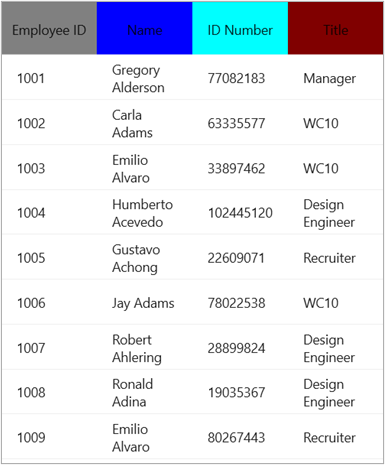

# Set different Background Color for each column header in MAUI DataGrid
The .NET [MAUI DataGrid](https://www.syncfusion.com/maui-controls/maui-datagrid) (SfDataGrid)  allows you to set different background color for each column header by using the [DataGridColumn.HeaderTemplate](https://help.syncfusion.com/cr/maui/Syncfusion.Maui.DataGrid.DataGridColumn.html#Syncfusion_Maui_DataGrid_DataGridColumn_HeaderTemplate) property.
The below code illustrates how to set the different background color for each column header.

## XAML
```XAML
<syncfusion:SfDataGrid x:Name ="dataGrid"
                    AutoGenerateColumnsMode="None"
                    ItemsSource="{Binding Employees}">

    <syncfusion:SfDataGrid.Columns>
        <syncfusion:DataGridTextColumn  MappingName="EmployeeID">
            <syncfusion:DataGridTextColumn.HeaderTemplate>
                <DataTemplate>
                    <Label Text="Employee ID"
                        FontAttributes="Bold"
                        TextColor="Black" 
                        BackgroundColor="Gray" 
                        VerticalTextAlignment="Center" 
                        HorizontalTextAlignment="Center"/>
                </DataTemplate>
            </syncfusion:DataGridTextColumn.HeaderTemplate>
        </syncfusion:DataGridTextColumn>

        <syncfusion:DataGridTextColumn  MappingName="Name">
            <syncfusion:DataGridTextColumn.HeaderTemplate>
                <DataTemplate>
                    <Label Text="Name" 
                        FontAttributes="Bold" 
                        TextColor="Black" 
                        BackgroundColor="Blue" 
                        VerticalTextAlignment="Center" 
                        HorizontalTextAlignment="Center"  />
                </DataTemplate>
            </syncfusion:DataGridTextColumn.HeaderTemplate>
        </syncfusion:DataGridTextColumn>

        <syncfusion:DataGridTextColumn  MappingName="IDNumber">
            <syncfusion:DataGridTextColumn.HeaderTemplate>
                <DataTemplate>
                    <Label Text="ID Number" 
                        FontAttributes="Bold" 
                        TextColor="Black" 
                        BackgroundColor="Aqua" 
                        VerticalTextAlignment="Center" 
                        HorizontalTextAlignment="Center"/>
                </DataTemplate>
            </syncfusion:DataGridTextColumn.HeaderTemplate>
        </syncfusion:DataGridTextColumn>
        <syncfusion:DataGridTextColumn  MappingName="Title">
            <syncfusion:DataGridTextColumn.HeaderTemplate>
                <DataTemplate>
                    <Label  Text="Title" 
                        FontAttributes="Bold" 
                        TextColor="Black" 
                        BackgroundColor="Maroon" 
                        VerticalTextAlignment="Center" 
                        HorizontalTextAlignment="Center"/>
                </DataTemplate>
            </syncfusion:DataGridTextColumn.HeaderTemplate>
        </syncfusion:DataGridTextColumn>
    </syncfusion:SfDataGrid.Columns>
</syncfusion:SfDataGrid>
```
The following screenshot shows the Column header with different background,



Take a moment to pursue this [documentation](https://help.syncfusion.com/maui/datagrid/overview), where you can find more about Syncfusion .NET MAUI DataGrid (SfDataGrid) with code examples.
Please refer to this [link](https://www.syncfusion.com/maui-controls/maui-datagrid) to learn about the essential features of Syncfusion .NET MAUI DataGrid(SfDataGrid).
### Conclusion
I hope you enjoyed learning about how to bind DataTable collection to MAUI DataGrid (SfDataGrid).
You can refer to our [.NET MAUI DataGrid’s feature tour](https://www.syncfusion.com/maui-controls/maui-datagrid) page to know about its other groundbreaking feature representations. You can also explore our .NET MAUI DataGrid Documentation to understand how to present and manipulate data.
For current customers, you can check out our .NET MAUI components from the [License and Downloads](https://www.syncfusion.com/account/downloads) page. If you are new to Syncfusion, you can try our 30-day free trial to check out our .NET MAUI DataGrid and other .NET MAUI components.
If you have any queries or require clarifications, please let us know in comments below. You can also contact us through our [support forums](https://www.syncfusion.com/forums), [Direct-Trac](https://support.syncfusion.com/account/login?ReturnUrl=%2Faccount%2Fconnect%2Fauthorize%2Fcallback%3Fclient_id%3Dc54e52f3eb3cde0c3f20474f1bc179ed%26redirect_uri%3Dhttps%253A%252F%252Fsupport.syncfusion.com%252Fagent%252Flogincallback%26response_type%3Dcode%26scope%3Dopenid%2520profile%2520agent.api%2520integration.api%2520offline_access%2520kb.api%26state%3D8db41f98953a4d9ba40407b150ad4cf2%26code_challenge%3DvwHoT64z2h21eP_A9g7JWtr3vp3iPrvSjfh5hN5C7IE%26code_challenge_method%3DS256%26response_mode%3Dquery) or [feedback portal](https://www.syncfusion.com/feedback/maui?control=sfdatagrid). We are always happy to assist you!

